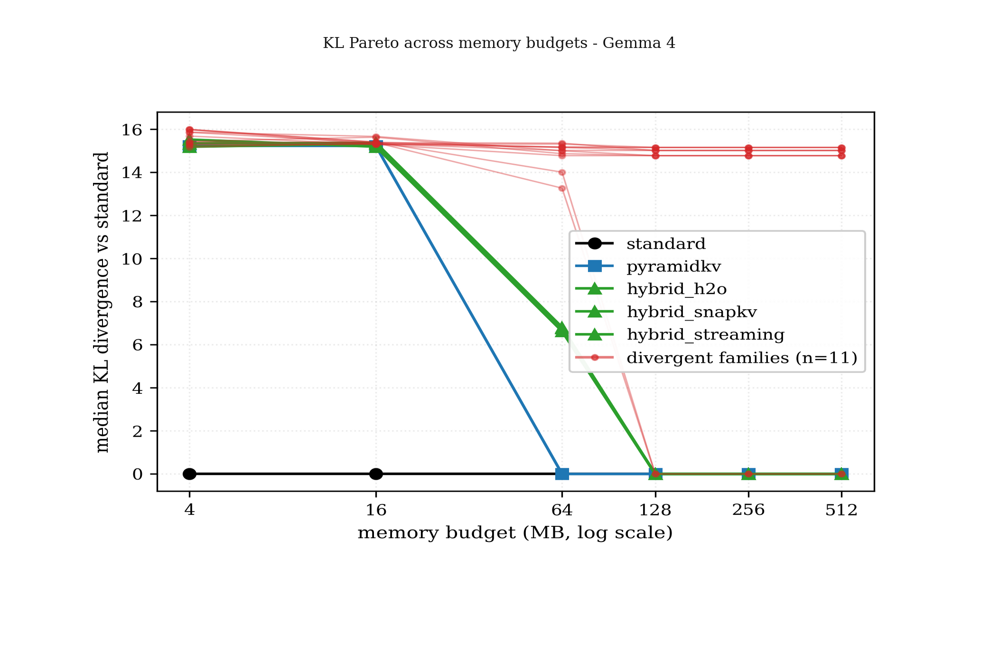
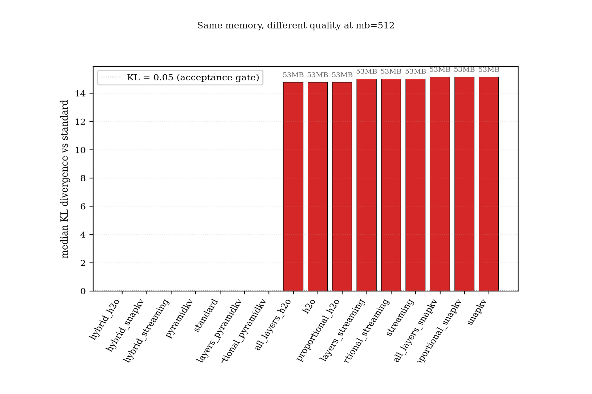

# KVLens

*v0.1 — 2026-05*

A from-scratch PyTorch case study of KV-cache eviction on Gemma 4.

KVLens studies what happens when the same Gemma 4 E4B model runs with
memory-equivalent KV caches that retain different token-position patterns. The
headline finding is that cache size alone is not enough: strategies that fit the
same memory budget can produce sharply different KL divergence because Gemma 4's
hybrid sliding/global attention is sensitive to which positions survive.

> [!IMPORTANT]
> **Read the full case study:** [`study/gemma4-kv-cache-eviction.md`](study/gemma4-kv-cache-eviction.md)
>
> The case study includes the full argument, all figures, reproduction notes,
> and limitations.

## Study highlights

<p>
  
  
</p>

- **Same memory is not the same cache.** Memory-equivalent strategies can land
  in very different KL regimes when they keep different token positions.
- **Position pattern matters most once Gemma 4's sliding window engages.** FIFO
  recency on sliding layers stays close to the reference, while sparse
  retained-position patterns can diverge sharply.
- **Gemma 2 is a scope check, not a universal claim.** The comparison helps
  separate Gemma 4 hybrid-attention behavior from generic KV-cache effects.

The engine is intentionally explicit and inspectable: no `transformers`, no
vLLM, no `nn.MultiheadAttention`, and no inference framework hiding attention or
cache updates.

## What's in this repo

- Case study: `study/gemma4-kv-cache-eviction.md`
- From-scratch PyTorch Gemma 4 / Gemma 2 implementation: `src/kvlens/`
- KV-cache strategies behind a shared interface: `src/kvlens/cache/`
- Reproducibility scripts: `scripts/`
- Evaluation prompts: `prompts/eval_prompts.txt`
- Result artifacts: `results/`

## Reproducing

### Locally, no GPU

```bash
pip install -e ".[dev]"
pytest -m "not integration"
```

What can be regenerated offline from the committed JSON artifacts alone:

- The length-threshold ablation, the Gemma 2 comparison, and the already
  generated global-eviction sensitivity text in
  `results/gemma4_full_sweep/global_eviction_sensitivity.txt`.

What additionally needs the full-sweep JSON (`results/gemma4_full_sweep/results.json`)
or a full GPU rerun:

- Figures 1, 2, and 4, and regenerating the global-eviction sensitivity
  analysis via `python scripts/analyze_global_eviction_sensitivity.py` and
  `python scripts/generate_study_figures.py`. That source JSON is not shipped
  in this publication tree; add it or rerun the full Gemma 4 sweep below.

### Full GPU experiments

Set `HF_TOKEN` for gated Gemma weights. The scripts run on any GPU provider or
workstation with the listed VRAM.

> **Fast-path reproduction:** `scripts/run_gemma4_hybrid_canary.sh` reproduces
> the qualitative headline (5 prompts × 16 strategies × 3 budgets) in ~10
> minutes on a 24 GB GPU and emits `results/gemma4_hybrid_canary/results.json`.
> The already-committed canary artifacts confirm the bimodal-KL story, so the
> full 90-minute sweep is not required for the qualitative result.

| Script | Purpose | VRAM | Approx wall-clock |
|---|---|---:|---:|
| `scripts/run_gemma4_sweep.sh` | Full Gemma 4 sweep: 16 strategies x 6 budgets x 50 prompts | >= 24 GB | ~90 min on A100 |
| `scripts/run_gemma4_hybrid_canary.sh` | Hybrid-family validation: 5 prompts x 3 budgets | >= 24 GB | ~10 min |
| `scripts/run_gemma4_length_ablation.sh` | Length-threshold ablation | >= 24 GB | ~25 min |
| `scripts/run_gemma2_comparison.sh` | Gemma 2 comparison: 5 prompts at 7.5k tokens | >= 8 GB | ~10 min |

The main public paths are:

- `results/gemma4_full_sweep`
- `results/gemma4_hybrid_canary`
- `results/gemma4_length_ablation`
- `results/gemma2_comparison`

Validate a completed Gemma 4 sweep with:

```bash
python scripts/validate_results.py \
  --profile gemma4 \
  --results results/gemma4_full_sweep/results.json \
  --figures results/gemma4_full_sweep/figures
```

## Engine details

KVLens keeps the Gemma execution path visible for research and debugging:

- manual Q/K/V projections, RoPE, masking, softmax, and cache updates
- Gemma 4 hybrid sliding/global layer behavior with heterogeneous head
  dimensions
- Gemma 2 2B comparison configuration
- swappable cache strategies through `create_cache()`
- instrumentation for cache memory, evictions, attention mass, and per-token
  latency

See [`docs/architecture.md`](docs/architecture.md) for the implementation tour.

## Development

```bash
ruff check .
ruff format --check .
mypy src/kvlens
pytest -q --tb=short -m "not integration"
python -m compileall -q scripts src/kvlens tests
```

## License

MIT. See [`LICENSE`](LICENSE).
