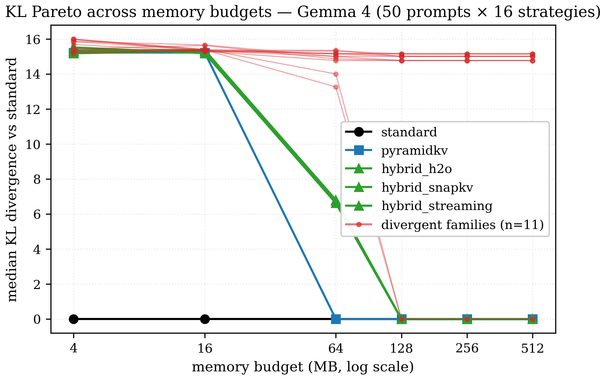
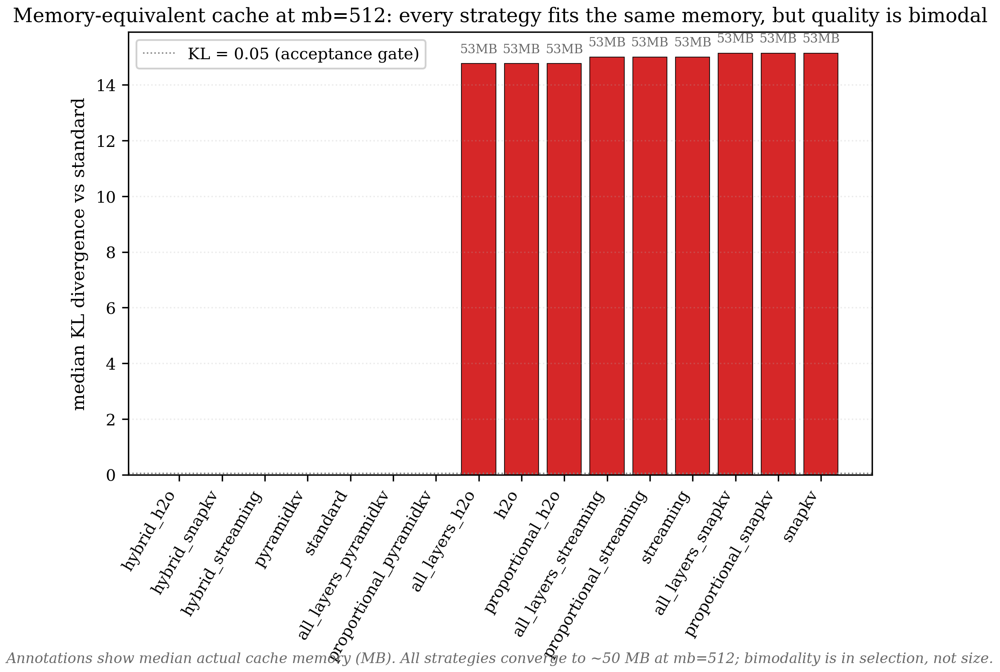
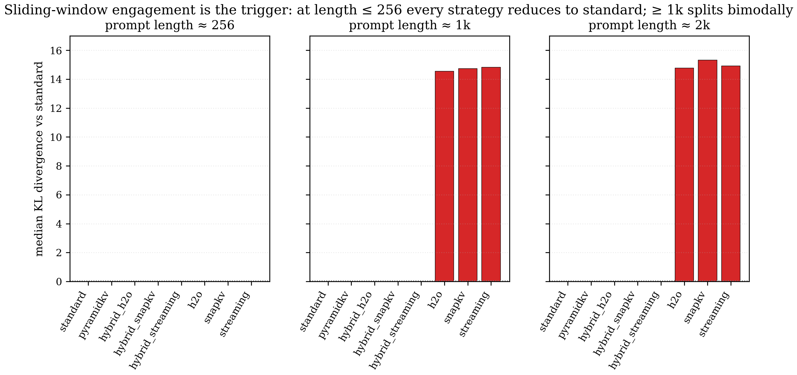
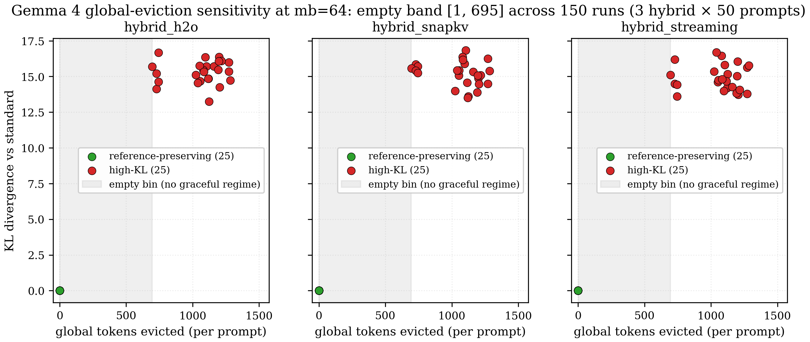
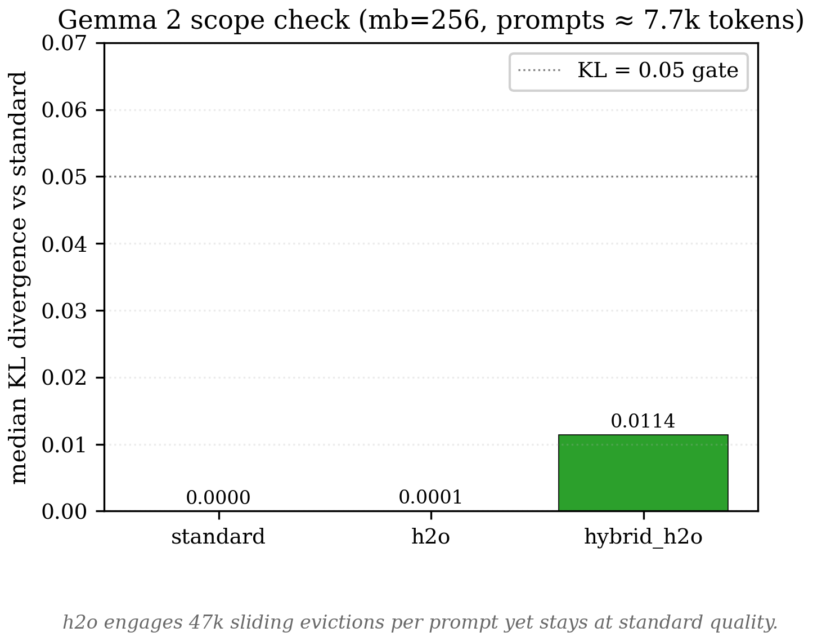

# KV cache eviction on Gemma 4: a case study

*v0.1 — 2026-05. Source data, scripts, and figures live alongside this file in `results/`, `scripts/`, and `study/figures/`.*

> **Why this matters.** On Gemma 4's hybrid sliding/global attention, KV eviction fails by retaining the wrong token positions, not merely by using too much memory. In the committed canary, once prompts cross the 512-token sliding window, equal per-layer cache sizes separate sharply: H2O, SnapKV, and StreamingLLM diverge from the no-eviction reference at KL ≈ 15, while strategies that keep FIFO recency inside sliding layers preserve it at KL ≈ 0 (standard FIFO; PyramidKV lands there in this regime). Before porting an eviction method to a Gemma 4-style hybrid model, sweep across the sliding-window boundary and verify retained positions in sliding and global layers — fixed-budget rankings alone are not enough. See §7 for the operational discussion.

---

## TL;DR

This is a study of how four well-known KV cache eviction strategies — H2O, SnapKV, StreamingLLM, PyramidKV — behave on **Gemma 4** (a hybrid sliding/global-attention LLM with a 512-token sliding window). The short version:

1. Three of the four (H2O, SnapKV, StreamingLLM) **do not preserve Gemma 4 behavior** at every memory budget tested, including budgets large enough that the strategies have the same per-layer cache lengths and actual memory as the no-extra-eviction baseline. Median KL divergence sits around 14-15 across budgets from 4 MB to 512 MB.
2. PyramidKV preserves the reference from 64 MB onward in this sweep because its within-sliding-layer rule is recency, and at moderate budgets its per-layer allocation happens not to pressure global layers.
3. The trigger is **sliding-window engagement** — the prompt being long enough that sliding layers have to drop tokens. At prompt length 256 (below the 512 window) every strategy preserves the reference. At length 1k or 2k a bimodal split appears.
4. The discriminator is **which** tokens get kept inside each sliding layer, not how many. Strategies that keep FIFO recency preserve the reference; strategies that replace it with sparse or non-recency selection diverge — even when the cache size is identical.
5. Gemma 4's global layers show a separate sharp transition at the tested mb = 64 diagnostic cell: across 150 runs, zero global evictions produce KL = 0, while the observed high-eviction cases start at 696 evictions and produce KL ≈ 15. The threshold's shape outside that cell is not characterized.
6. A controlled-experiment family (`hybrid_*`, defined in §5) isolates the within-sliding-layer rule from the per-layer budget. The experiment confirms the diagnosis. It does **not** beat PyramidKV at tight budgets, which clarifies the second constraint: global-layer budget pressure (§6).

The headline takeaway: on Gemma 4, "fits within the memory budget" is not a sufficient guarantee that an eviction strategy will work. The trained position pattern of the sliding heads is a separate constraint, and the strategies tested here have no machinery to respect it.

A short comparison with **Gemma 2** appears in §8. The findings above are scoped to **Gemma 4 only**.

---

## 1. Setup

If you already know KV cache eviction and Gemma 4's architecture, skip to §2.

### 1.1 KV caches and eviction

When a language model generates text token-by-token, every transformer layer needs the **keys** and **values** (K and V) computed for every previous token, on every step. To avoid recomputing them each time, the model **caches** them in GPU memory — the "KV cache". The cache grows linearly with prompt length, and for long prompts it can dominate memory.

**KV cache eviction** is the family of strategies that throw away some cached tokens to keep the cache bounded. The strategies disagree on **which tokens to keep**:

| Strategy | What it keeps |
|---|---|
| `standard` (the no-extra-eviction baseline) | Everything that the model's own architectural rules permit. On Gemma 4 this means full context on global layers, plus FIFO down to the trained 512-token sliding window on sliding layers. Reference quality — every other strategy is compared to this. |
| **FIFO / recency window** | The N most recent tokens — same rule `standard` uses internally on sliding layers, but applied as an explicit budget rather than the architectural cap. |
| **StreamingLLM** | The first 4 "sink" tokens **plus** the N − 4 most recent. |
| **H2O** | The N tokens with the highest cumulative attention score. |
| **SnapKV** | At the prefill→decode boundary, picks the top-N tokens by attention from a "look-ahead" window of recent queries. |
| **PyramidKV** | Allocates **different** budgets per layer (more for shallow, less for deep), but inside each layer uses a recency-style rule. |

Most of these were originally evaluated on dense-attention long-context models (Llama, Mistral). They generally degrade gracefully on those: smaller budget → slightly worse quality.

### 1.2 Gemma 4

Gemma 4 doesn't use uniform attention across layers. It alternates two layer kinds:

- **Sliding-window layers** attend only to the last `window_size` tokens. Cheap.
- **Global layers** attend to everything from the start. Expensive but long-range.

In Gemma 4 E4B specifically:

- 42 layers total
- **Sliding window = 512 tokens**, present on 35 of the 42 layers
- 7 global layers (every 6th)
- Sliding head_dim = 256; global head_dim = 512
- The last 18 layers share KV state with earlier same-type layers (an architectural optimisation that doesn't change the main interpretation until §6)

The narrow 512-token sliding window is the load-bearing detail. Whenever a prompt is longer than 512 tokens, every sliding layer has to drop tokens during prefill.

### 1.3 How quality is measured

Each strategy's output distribution is compared to `standard`'s output distribution on the same prompt, using **KL divergence**: a non-negative number; 0 means identical distribution; larger = more different. A strategy that preserves model behaviour produces KL ≈ 0; a strategy that diverges sharply from the reference produces KL in double digits.

### 1.4 Iso-memory budgeting

Different strategies allocate different bytes-per-cached-token (because some layers have larger head dimensions than others). To compare fairly, each strategy is run at a target total cache memory (e.g. 64 MB) and the strategy decides how to spend that across layers. This is iso-memory comparison, as opposed to iso-tokens-per-layer.

---

## 2. Observation: memory-equivalent caches can diverge

A Gemma 4 diagnostic sweep covered 50 prompts × 16 strategies × 6 memory budgets — 4,800 generations in total. If memory budget were the dominant constraint, smaller budgets would produce worse quality and larger budgets would recover reference behavior.

The data instead looked like this:

**Figure 1.** *Median KL divergence (vs the no-eviction baseline) across memory budgets on Gemma 4. The light red lines are eleven different eviction-strategy variants — H2O, SnapKV, StreamingLLM, and their `all_layers_*` and `proportional_*` siblings. They are stuck around KL ≈ 15 across **every** budget from 4 MB to 512 MB. The blue square (PyramidKV) drops to zero from 64 MB onward; the green triangles (the hybrid family — explained later) drop to zero from 128 MB onward after partially diverging at 64 MB. The black circles are the no-eviction reference, KL = 0 by construction.*

Two observations point away from a simple memory-budget explanation:

1. The divergent strategies are not improving with more memory. At mb = 4 they diverge sharply. At mb = 512 they diverge just as sharply. If this were a memory-budget problem, more budget would help. It does not.
2. PyramidKV preserves the reference from 64 MB onward. It is not architecturally simpler than H2O / SnapKV / StreamingLLM. It is just *different* in some way that matters for Gemma 4.

Median perplexities at mb = 512 confirm the picture: `standard` and `pyramidkv` give ppl ≈ 19; the divergent families give ppl ≈ 10⁸ (yes, hundreds of millions).

So "the strategies need more memory budget" cannot be the whole explanation.

---

### 2.1 Cache state check at mb = 512

Per-layer cache state was instrumented at mb = 512 (the most generous budget). Even though the strategies *select* tokens differently, at mb = 512 every strategy ends up with the same number of tokens per layer (sliding layers all hit Gemma 4's architectural cap of 512; global layers all stay at full prompt length). All 16 strategies report:

- Same per-layer cache lengths
- Same total memory (~50 MB)
- Same number of evictions per layer

…yet the KL divergence is bimodal:

**Figure 2.** *At mb = 512, all 16 strategies fit in the same total memory (~50 MB; annotations show the divergent bars) and report identical per-layer cache shapes. Quality is bimodal: the green (hybrid family), blue (pyramidkv) and black (standard) bars sit at KL ≈ 0; the red bars sit at KL ≈ 15. The dotted grey line is the reference-preservation gate (KL ≤ 0.05). The bars show median KL across 50 prompts.*

This shifts the interpretation from memory budget to cache content: the memory accounting can look identical while the retained token pattern differs.

---

## 3. Observation: divergence begins when the sliding window engages

If the divergence is not about memory, when does it appear? Hypothesis: it appears when a sliding layer has to drop tokens during prefill — i.e. when the prompt is longer than the trained sliding window of 512.

A length-threshold ablation was run on Gemma 4. Prompts at three lengths:

- **256 tokens** (well below the 512 sliding window — sliding layers never have to drop anything)
- **1024 tokens** (above the window)
- **2048 tokens** (further above)

All other settings held constant: mb = 512, 5 prompts per length, 8 strategies including the divergent ones.

**Figure 3.** *Median KL by strategy, on Gemma 4 at mb = 512, for three prompt-length bins. **Length 256** (left): every strategy is at KL ≈ 0, including h2o, snapkv and streaming. **Length 1k** (middle) and **2k** (right): the bimodal split appears — h2o, snapkv, streaming jump to KL ≈ 14-15; the reference-preserving strategies stay at zero. The divergence is full-magnitude immediately and saturates between 1k and 2k.*

Two observations:

- The trigger is **discrete, not gradual**. At length 256 every strategy preserves the reference. At length 1k, the divergent strategies already show the full effect. There is no smooth degradation as the prompt approaches the window length.
- The divergence magnitude is roughly the same at length 1k and 2k. Once the trained window is violated, doubling the violation does not make things worse.

The simplest explanation that fits all the behaviour is a **trained-pattern violation**: as long as the sliding heads see the FIFO recency pattern they were trained with, the tested strategies match the reference. The moment the sliding layer has to drop tokens, the strategies that replace FIFO with sparse or non-recency retained sets present the model with a different retained-position/content pattern.

This is the simplest explanation; it isn't a proof. There's no inspection of attention weights or RoPE frequencies here showing the heads going off-distribution, just behaviour: the divergence is gated by sliding-window engagement, and the affected strategies are the ones that replace FIFO recency inside sliding layers. Whether a small amount of non-contiguity alone is sufficient remains an open diagnostic question.

---

## 4. Interpretation: retained position pattern matters

The divergence appears when a sliding layer has to evict. That tells where in the model the sensitivity lives, but not what the rule is. Why do some strategies preserve the reference and others diverge, when both evict on sliding layers?

Look at the within-sliding-layer behaviour of each strategy on Gemma 4:

| Strategy | Within-sliding-layer rule |
|---|---|
| `standard` | FIFO — drop the oldest, keep the most recent 512 |
| `pyramidkv` | Per-layer budget allocation, but inside each layer: FIFO recency |
| `h2o` | Keep the tokens with the **highest cumulative attention score** |
| `snapkv` | At prefill→decode boundary, keep the top-N tokens by attention from a look-ahead window |
| `streaming` | Keep the **first 4 "sink" tokens** plus the most-recent (N − 4) |

The split lines up exactly:

- Reference-preserving strategies at non-tight budgets use **FIFO recency** in each sliding layer (Standard, PyramidKV).
- Divergent strategies replace FIFO with **sparse or non-recency** retained sets (H2O, SnapKV, StreamingLLM).

StreamingLLM is the closest to "almost FIFO" — it keeps the most-recent N − 4, plus 4 tokens from positions 0–3. Those 4 sink tokens at very-old positions make the retained set non-contiguous, which is a plausible contributor to moving the layer off the reference behavior.

PyramidKV preserves the reference from 64 MB onward for two separate reasons. It was originally designed as a per-layer budget allocator (the "pyramid": shallower layers get more cache, deeper get less), but its within-layer rule is recency. The pyramid is what prevents global-layer eviction at moderate budgets (more on this in §6); the recency rule is what avoids sliding-layer divergence once the budget is large enough for those two axes to be feasible.

---

## 5. Diagnostic intervention: keep recency on sliding layers

A hypothesis (within-layer recency is necessary) plus a confound (PyramidKV gets two things right at once: recency *and* a pyramid budget that is gentle on globals) needs a controlled experiment.

The construction: a strategy family that is recency-on-sliding by construction, while letting the global-layer policy vary independently. It is called `hybrid_*`. For each strategy `X` in {h2o, snapkv, streaming}, `hybrid_X`:

- Uses **standard FIFO** on every sliding layer (so the sliding heads always see a contiguous recent window — the position pattern they were trained on).
- Applies **strategy X** only on the global layers.
- Allocates the entire memory budget to the global layers (sliding layers ride their architectural cap; no extra budget given to them).

Total implementation cost: ~30 lines, zero new cache classes. Two existing primitives are composed.

**Sanity check 1 — byte equality at non-binding budget.** With a memory budget large enough that no eviction is forced anywhere, `hybrid_h2o` should produce KV state byte-identical to `standard` on every layer (because it does FIFO on sliding layers, just like standard, and globals don't have to evict because the budget is generous). A unit test for this lives in the repo and passes:

> `tests/test_iso_memory.py::test_hybrid_h2o_at_huge_budget_matches_standard_on_kv_state`

This is the mechanistic check on the construction itself: had it disagreed, the diagnosis would have been wrong.

**Sanity check 2 — diagnosis-confirming behaviour at sufficient budget.** On the full Gemma 4 sweep at memory budgets ≥ 128 MB, `hybrid_h2o`, `hybrid_snapkv`, and `hybrid_streaming` all produce median KL = 0.0 across the 50-prompt set. They preserve the reference — *while their non-hybrid siblings diverge at the same budget*. Same H2O scoring logic, applied only to globals: reference behavior. Applied to sliding layers: large divergence.

So on the diagnostic question (axis 1 — within-sliding-layer rule), the experiment cleanly confirms: recency is what matters. Switch the within-sliding-layer rule from sparse to FIFO and the model preserves the reference.

---

## 6. Second constraint: global-layer budget pressure

The `hybrid_*` family gives the entire memory budget to the layers that can actually attend long-range (the globals), while PyramidKV spreads its budget across all layers including ones that hit their architectural cap anyway. That isolates a second question: once sliding layers are safe, how sensitive is Gemma 4 to global-layer eviction?

At **mb = 64** on the Gemma 4 sweep, `hybrid_h2o` diverges on 25 of 50 prompts (median KL = 6.6). `pyramidkv` diverges on **0** of 50 prompts (KL = 0 on every prompt). PyramidKV is better at this budget because it avoids global-layer pressure while also preserving recency in sliding layers.

Per-prompt eviction counts on the Gemma 4 sweep produced this:

**Figure 4.** *Per-prompt scatter at mb = 64 on Gemma 4 for the three hybrid strategies. X-axis: number of global tokens evicted on this prompt. Y-axis: prompt-level KL divergence. Green dots are runs where the model preserved the standard-cache reference; red dots are runs where it diverged. In this 150-run slice (3 hybrid strategies × 50 prompts), the grey shaded band [1, 695] is empty: no run has 1-695 global-token evictions. The observed split is zero global evictions (→ KL = 0) versus at least 696 evictions (→ KL ≈ 15).*

### Why "696" matters

The number 696 is not magical, and it is not a constant of nature. It is **the smallest number of global-token evictions any high-KL run exhibited** across all three hybrid strategies and all 50 prompts at mb = 64 — i.e. 150 runs total.

To anchor what that number means concretely on Gemma 4: at mb = 64, the hybrid allocator splits 64 MB across the 7 global-layer indices, giving each ≈ 9.14 MB. With Gemma 4's per-token cost on a global layer of 4 KB (head_dim 512 × 2 KV heads × both K and V × 2 bytes per fp16 element), each global layer caps at **≈ 2,340 tokens**. Prompts with effective length (prompt + generation) ≤ 2,340 tokens trigger zero global eviction; longer prompts trigger eviction. *(Side note: of those 7 global-layer indices only 4 hold independent KV state — the last 3 reuse earlier same-type layers via KV-sharing — but the allocator does not distinguish, so the unused budget on the shared indices is wasted, not harmful.)*

Three things make 696 worth pointing at:

1. **It bounds the empty band.** If the sensitivity had started smoothly — at, say, 50 evictions producing KL ≈ 1, then 200 producing KL ≈ 5, then 700 producing KL ≈ 15 — the picture would be a gradual quality-vs-eviction trade-off. Instead, every run with ≥ 696 evictions diverged, every run with 0 evictions preserved the reference, and the bin in between is empty. The empty band [1, 695] across 150 runs is what makes this a sharp transition in the observed mb = 64 slice rather than just a memory-budget curve, while still leaving the threshold's shape between sampled prompt/budget points unresolved.
2. **It is a small absolute number.** 696 evictions across the 4 active global layers ≈ **174 evicted tokens per layer**, on a layer that would otherwise hold ~2,500 tokens for this prompt — roughly **~7 % of the layer's would-be state**. Within this diagnostic slice, Gemma 4 diverges sharply after losing ~7 % of its global cache. That sensitivity — observed at one budget cell across 150 runs — is what makes the threshold worth isolating, not the literal number 696, and it has not been characterised outside this slice.
3. **What is general vs what is specific.** General: the empty bin between "no global eviction" and "large divergence" was observed on 150 / 150 runs, and the threshold sits at a small fraction of the cache in this slice. Specific: the literal number 696 corresponds to one budget cell (mb = 64) on the 50-prompt set used here. It would change with prompt length, model size, or budget. The observation is a sharp transition at this diagnostic cell — not a fully characterized model-wide threshold.

### What this means for the framing

The `hybrid_*` diagnostic makes two independent axes visible:

1. **Within-sliding-layer rule.** Recency was necessary in this Gemma 4 sweep. Sparse selection violates the trained position pattern of sliding heads. The memory-equivalent comparison (§2) and the length-threshold ablation (§3) establish this behaviorally.
2. **Per-layer budget allocation.** Must avoid pressuring global layers at moderate budgets, because the mb = 64 diagnostic cell shows a sharp transition from no penalty to large divergence once global eviction engages. Figure 4 establishes this for the tested slice.

PyramidKV is safe on both axes at 64 MB and above in this sweep. H2O / SnapKV / StreamingLLM violate axis 1. The `hybrid_*` family fixes axis 1 by construction but pushes harder on axis 2 than PyramidKV does — and at mb = 64, that's what tips it over.

The reframe: `hybrid_*` is most useful as a controlled experiment that isolates axis 1. It is not a practical recommendation. The mb = 64 comparison clarifies the two-axis constraint more usefully than a single "new family wins" result would have.

---

## 7. Practical implications for Gemma 4 experiments

Using Gemma 4 with KV cache eviction:

- **PyramidKV is the only off-the-shelf strategy from the four tested that preserves Gemma 4 behavior from 64 MB onward in this sweep.** It works because its within-layer rule is recency *and* its budget allocation happens to under-pressure globals in that budget range.
- **H2O, SnapKV, StreamingLLM as published produce extremely degraded outputs on Gemma 4 the moment a prompt exceeds 512 tokens.** This is not a "tune the budget" problem; increasing the memory budget does not help.
- **Memory budget is necessary but not sufficient.** A strategy that fits in 128 MB can still produce 10⁸-perplexity outputs if it gets the within-sliding-layer rule wrong.

Designing a new KV cache eviction strategy for Gemma 4 (or a similar architecture):

- **Prefer recency inside sliding layers.** Trained-window contiguity matters in this Gemma 4 sweep, at least on this narrow-window architecture.
- **Be careful with global-layer eviction on Gemma 4.** Figure 4 shows no observed middle ground at mb = 64: the tested runs either avoid global eviction or jump to high KL once global eviction engages.
- **Test on the actual model.** Behaviour validated on Llama with a 32k context window does not necessarily carry over to Gemma 4 with its 512 sliding window.

Doing further research:

- The factorisation in §6 (within-layer rule × per-layer budget) is a useful conceptual tool. It may not be exhaustive.
- The mechanistic question — why exactly Gemma 4 diverges under non-recency selection — is open. A targeted study comparing attention maps on a high-KL Gemma 4 prompt vs the same selection rule on a model that preserves the reference (see §8) would settle the trained-pattern story.

---

## 8. Scope and limitations

- **One model.** All findings are on Gemma 4 E4B. Mistral hybrid variants, Mamba+attention hybrids, Llama with sliding windows, Gemma 3 — none of them are in the data set.
- **Behavioural-level analysis only.** The "trained position pattern" explanation is supported by the length threshold (Figure 3), the memory-equivalent comparison (Figure 2), and the within-layer-rule split (§4). It is not supported by attention-weight inspection or RoPE-frequency analysis. The explanation is the simplest one consistent with the data; alternatives are possible.
- **One budget cell for the global-eviction threshold.** Figure 4 is observed at mb = 64 on the 50-prompt set used here. The threshold's dependence on prompt length, head dimension, number of global layers, or budget hasn't been characterised.
- **No practical recommendation for `hybrid_*`.** PyramidKV is better than `hybrid_*` at 64 MB and ties it at higher tested budgets where both preserve the reference.
- **`standard` is the reference, not ground truth.** KL = 0 against `standard` means "indistinguishable from the model with full cache", not "perfect generation".

### Evidence sufficiency

The current evidence is enough for a Gemma 4 case study: it shows memory-equivalent cache states can produce different KL, the split appears when the 512-token sliding window engages, and a diagnostic family recovers reference behavior when sparse selection is kept off sliding layers. It is not enough for an operator-level mechanism or cross-model generalization claim.

---

### Gemma 2 scope check

For context, the same divergent strategy was spot-checked on Gemma 2 (a related architecture but with sliding window 4096 instead of 512), with prompts long enough to engage the wider window. The setup: 5 prompts at ~7,500 tokens (one per prompt category), `standard`, `h2o`, and `hybrid_h2o` at mb = 256.

| Strategy | n | median KL | median ppl | sliding evictions per prompt | global evictions per prompt |
|---|---|---|---|---|---|
| `standard`   | 5 | 0.0000 | 1.14 | 47,723 | 0 |
| `h2o`        | 5 | **0.0001** | 1.14 | **47,723** | 0 |
| `hybrid_h2o` | 5 | 0.0114 | 1.12 | 47,723 | 35,438 |

H2O ran its full sparse-selection logic across 47,723 sliding-layer evictions per prompt (≈ 3,600 tokens evicted per layer × 13 sliding layers). On Gemma 4 the same machinery produces KL ≈ 15. On Gemma 2 it produces KL = 0.0001 — indistinguishable from no-eviction.

**Figure 5.** *On Gemma 2 with prompts at ~7.7k tokens (engaging Gemma 2's 4096-token sliding window), `h2o` and `standard` are essentially identical (KL = 0.0001 and 0). `hybrid_h2o`, which forces ~10 % global eviction (35k tokens), still passes the KL ≤ 0.05 acceptance gate. The Gemma 4 collapse signature does not appear here.*

What this contrast suggests:

- Sliding-window engagement is *necessary* for the Gemma 4 divergence pattern, but not *sufficient* across models. The same H2O scoring with similar activity levels diverges on Gemma 4 and not Gemma 2.
- Gemma 4's sliding heads appear unusually brittle to non-recency selection compared to Gemma 2's. Plausible architectural causes worth investigating: the eight-times-narrower sliding window (the most obvious candidate), head-dimension asymmetry between sliding (256) and global (512) layers on Gemma 4, or interactions with KV-sharing across the last 18 layers. *Note:* both Gemma 2 and Gemma 4 use `theta = 10000` with no interpolation on sliding layers — sliding-RoPE is not where the two models differ. The RoPE difference between them is on global layers (Gemma 4: `theta = 1e6`, `partial_factor = 0.25`; Gemma 2: `theta = 10000`), which is relevant to the global-layer eviction sensitivity in §6 but not to the sliding-layer position-pattern story.
- Gemma 2 also tolerates ~10 % global eviction without a meaningful KL penalty, where Gemma 4 in Figure 4 does not. The sharp global-eviction transition appears to be Gemma-4-specific in this comparison — but n = 5 prompts on one model is a small sample.

This subsection is a perspective, not a generalisation claim. The findings above are scoped to Gemma 4; the comparison with Gemma 2 makes that scope explicit rather than assumed.

---

## 9. Where the artifacts live

**Code.** All cache strategies live in `src/kvlens/cache/`. The three `hybrid_*` strategies and their allocator are in `src/kvlens/cache/__init__.py` (factory) and `src/kvlens/cache/allocation.py` (allocator). The byte-equality unit test is `tests/test_iso_memory.py::test_hybrid_h2o_at_huge_budget_matches_standard_on_kv_state`.

**Raw data.** Result JSONs and audits live under `results/`. The current artifact directory names are historical, but the data used here are:

- 13-strategy Gemma 4 baseline sweep across 6 budgets and 50 prompts.
- 16-strategy Gemma 4 sweep with the `hybrid_*` diagnostic family added.
- Gemma 4 length-threshold ablation at 256 / 1k / 2k prompt lengths.
- Per-prompt global-eviction sensitivity audit for the mb = 64 diagnostic cell.
- Small Gemma 2 comparison used only to scope the Gemma 4 interpretation.

**Figures.** Generated by `scripts/generate_study_figures.py`. Outputs in `study/figures/` as both PDF and PNG. Re-running the script after any change to the underlying results regenerates the figures deterministically.

---

## 10. Open questions

- **Other narrow-window hybrid models.** Does the Gemma 4 pattern reproduce on, e.g., Gemma 3, or any non-Gemma model with a similarly narrow trained sliding window? The data here can't answer this.
- **Operator-level mechanism.** A targeted study comparing attention-map distributions on a high-KL Gemma 4 prompt under H2O selection vs the same configuration on a model that preserves the reference would settle the position-pattern explanation.
- **The shape of the global-eviction threshold.** How does the threshold (Figure 4) scale with prompt length, head dimension, number of global layers, or budget? One budget cell is observed; the dependence isn't characterised.
- **Better budget allocation on Gemma 4 globals.** Given the sharp transition observed at mb = 64, the design problem in this budget range becomes "prefer allocations that avoid global eviction entirely" rather than "trade off global cache size smoothly against quality". That is a different optimisation and may have a clean solution.

Before adding more Gemma 4 compute, prefer no-compute checks first: tighten the narrative, audit existing result tables, and visualize retained positions from already-recorded cache metadata if available. New runs are useful only if they resolve one of two concrete gaps: the exact shape of the global-eviction threshold, or whether non-contiguity by itself is sufficient to cause high KL.

For this study draft, the existing figures and audits are sufficient to support the scoped Gemma 4 case-study claim. The next compute should wait until the narrative has been reviewed and a reader-facing gap is concrete.

If anything in this writeup is contradicted by data on a different model, prompt set, or budget cell, please open an issue with the data.

---

## References

The four eviction strategies studied here are from the published literature. The implementations under `src/kvlens/cache/` follow the methods described in:

- **H2O** — Zhang, Z., Sheng, Y., Zhou, T., Chen, T., Zheng, L., Cai, R., Song, Z., Tian, Y., Ré, C., Barrett, C., Wang, Z., Chen, B. (2023). *H₂O: Heavy-Hitter Oracle for Efficient Generative Inference of Large Language Models.* [arXiv:2306.14048](https://arxiv.org/abs/2306.14048).
- **SnapKV** — Li, Y., Huang, Y., Yang, B., Venkitesh, B., Locatelli, A., Ye, H., Cai, T., Lewis, P., Chen, D. (2024). *SnapKV: LLM Knows What You are Looking for Before Generation.* [arXiv:2404.14469](https://arxiv.org/abs/2404.14469).
- **StreamingLLM** — Xiao, G., Tian, Y., Chen, B., Han, S., Lewis, M. (2024). *Efficient Streaming Language Models with Attention Sinks.* [arXiv:2309.17453](https://arxiv.org/abs/2309.17453).
- **PyramidKV** — Cai, Z., Zhang, Y., Gao, B., Liu, Y., Liu, T., Lu, K., Xiong, W., Dong, Y., Chang, B., Hu, J., Xiao, W. (2024). *PyramidKV: Dynamic KV Cache Compression based on Pyramidal Information Funneling.* [arXiv:2406.02069](https://arxiv.org/abs/2406.02069).

The `hybrid_*` family (§5) is a controlled experiment defined in this repository and is not from prior published work.
